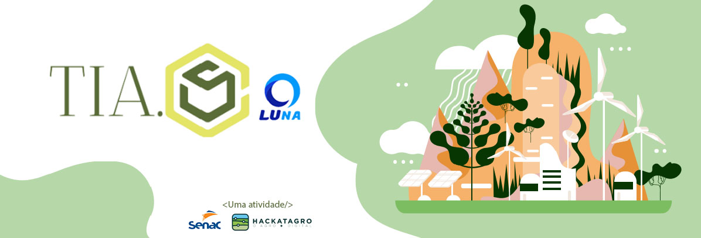
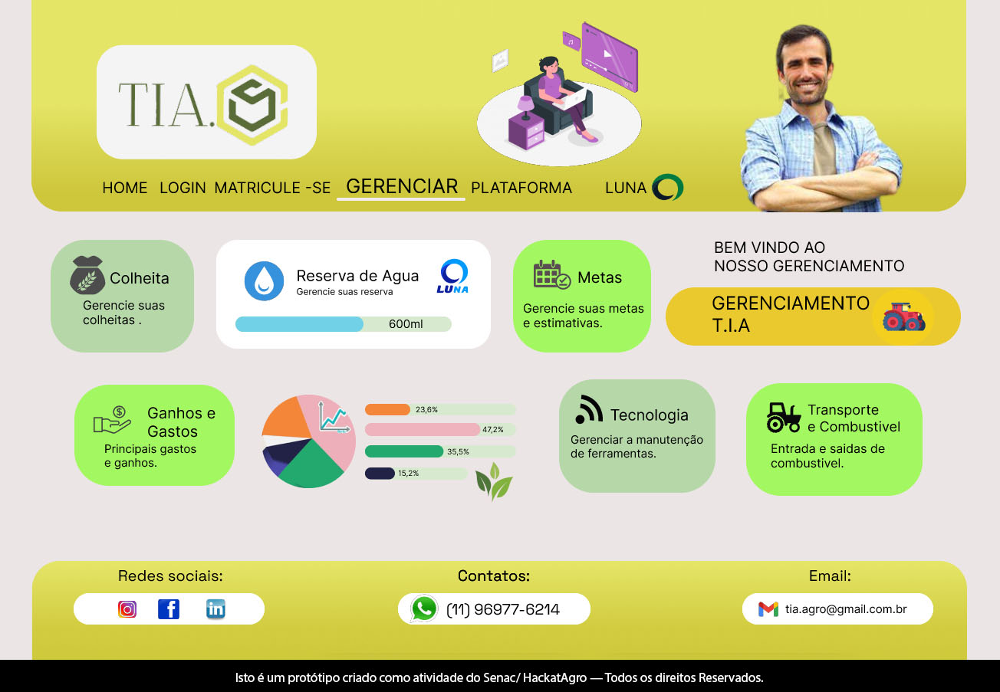
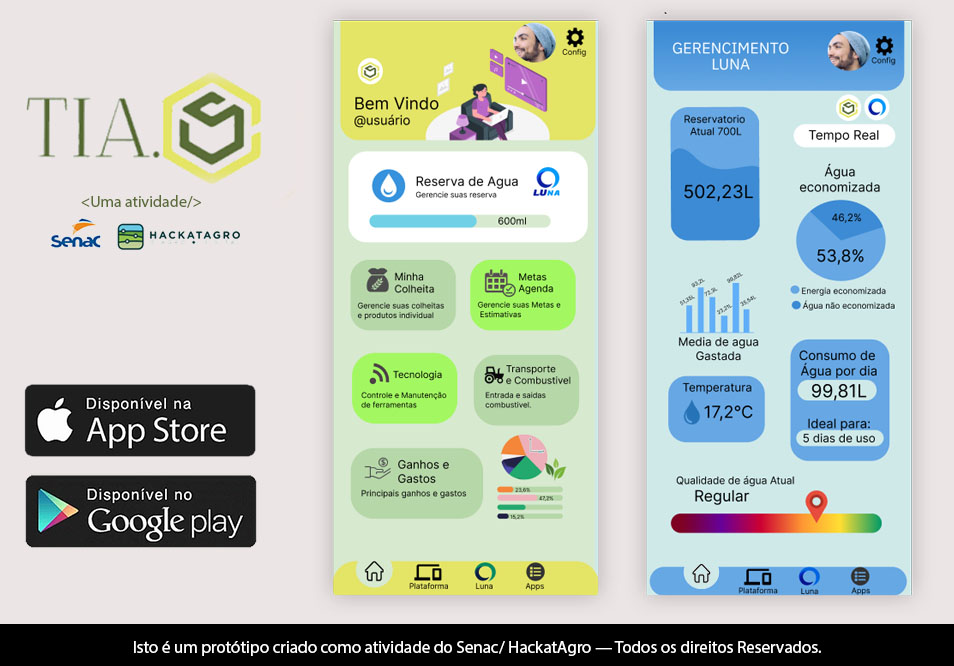

# HackatAgro-TIA_PROJECT

Softwares ultilizados: Figma 
<h2>Equipe</h2>
<a href= https://github.com/adrianocqueiroz>@adrianocqueiroz</a>
<a href= https://github.com/IsabelliOliveira>@IsabelliOliveira</a>
<a href= https://github.com/GuiDEV1>@GuiDEV1</a>
<a href= https://github.com/gwnhwyfarr>@gwnhwyfarr</a>
<a href= https://github.com/victorhmszzero>@victorhmszzero</a>

<h2>1. O QUE É? </h2>

A Luna é um dispositivo que fará o  controle de água, através do  armazenamento da água da chuva  para reutilização nas lavouras.

Pensando no meio ambiente, a Luna foi desenvolvida com materiais sustentáveis. Um dos aspectos da Luna é realizar a coleta de água e chuva, armazenando em um recipiente subterrâneo. Neste recipiente, a Luna irá fazer uma análise para ver a qualidade da água, indicando em qual estado ela está (boa ou ruim).

<h2>CONHEÇA A TIA</h2>

  
  

A Tia é uma plataforma desenvolvida pela Luna com propósito de capacitar produtores e suas equipes de forma simples, prática e eficaz.

Esses iriam desde irrigação até como a tecnologia pode ser aplicada em seu negócio, mostrando cases reais de grandes empresas.

<h3>Nossos prototipos</h3>

Projeto criado para o Hackatrago 2022 (26 até 28 de Agosto de 2022).

<a href= "https://www.figma.com/proto/sqW7KE69Qdtk2SBUwXIxWE/hacktrago-1.0?node-id=1%3A2&starting-point-node-id=1%3A2">
  
     Clique aqui para visualizar o versão desktop</a> 
<a href= "https://www.figma.com/proto/XwvLT2lb9N8mNmSYO3qTeX/hackatrago-mobbile?node-id=1%3A164&scaling=scale-down&page-id=0%3A1&starting-point-node-id=1%3A164">
  
      Clique aqui para visualizar a versão mobile</a>
